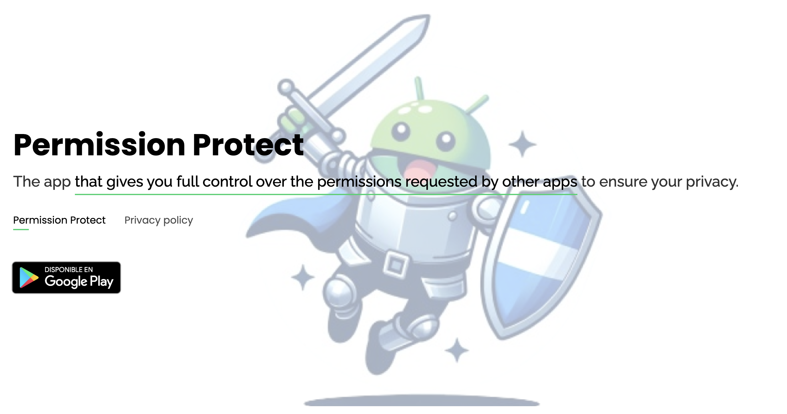
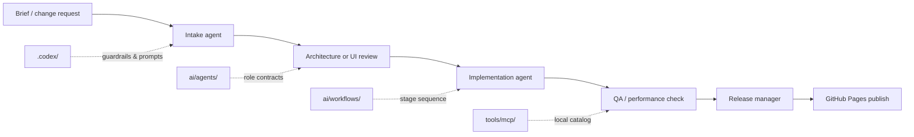

<div align="center">
  
  <h1>David Web</h1>
  <p><strong>Personal portfolio built with Kotlin Multiplatform and Compose Web.</strong></p>
  <p>
    <a href="https://deiivid.github.io/">Live site</a>
    ·
    <a href="#tech-stack">Tech stack</a>
    ·
    <a href="#ai-orchestration">AI Orchestration</a>
    ·
    <a href="#local-development">Run locally</a>
  </p>
</div>

<p align="center">
  
</p>

## Overview

This repository contains my portfolio web, implemented as a **Kotlin-first frontend** with **Compose Multiplatform for Web/Wasm**. The goal is not just to publish a static site, but to keep the UI, interactions, structure, and migration decisions inside a maintainable KMP codebase.

The project combines three layers:
- a production-facing portfolio
- a migration workspace for HTML/CSS parity and Compose implementation choices
- an AI orchestration layer for scoped technical work, review, and delivery

## Tech Stack

- Kotlin
- Compose Multiplatform Web
- Wasm target
- Coroutines
- GitHub Pages
- Repo-local AI context under `.codex/`, `ai/`, and `tools/mcp/`

## AI Orchestration

I use the repo as a controlled AI workspace, not as a free-form prompt dump. The orchestration layer is designed to keep technical work scoped, reviewable, and safe to hand off.

### Architecture

- `.codex/` holds the repo guardrails, prompts, and skills that define how AI work should behave here.
- `ai/agents/` contains role contracts for technical workers such as architecture, UI implementation, QA/performance, and release coordination.
- `ai/workflows/` contains deterministic multi-agent flows that chain those roles together for repeatable tasks.
- `tools/mcp/` documents the local MCP surface area and the supporting tooling used to keep that knowledge structured.

### Multi-agent flow



### What this enables

- clear ownership when multiple workers run in parallel
- narrower changes with explicit handoffs
- less drift between implementation, QA, and release decisions
- a technical operating model that is visible in the repository itself

### Current catalog

- `ai/agents/kmp-architect.yaml`
- `ai/agents/compose-ui-engineer.yaml`
- `ai/agents/ux-ui-auditor.yaml`
- `ai/agents/qa-performance.yaml`
- `ai/agents/release-manager.yaml`
- `ai/workflows/feature-from-brief.yaml`
- `ai/workflows/ui-parity-fix.yaml`
- `ai/workflows/release-to-pages.yaml`

If you want the deeper index, see [`ai/README.md`](ai/README.md).

## Highlights

- Kotlin-first web portfolio instead of a traditional HTML-only stack
- Responsive sections for hero, skills, timeline, projects, game, and contact
- GitHub Pages deployment flow for the published site
- Project-local prompts, agent contracts, and workflow specs to keep migration work consistent
- Clean separation between app code, migration docs, orchestration metadata, and local tooling

## Workflow

This repo is set up to support both product work and structured iteration:

1. **Design parity**
   - Compare the current Compose Web UI against the original HTML/CSS intent.
   - Keep visual decisions documented in `docs/migration/`.

2. **Implementation**
   - Build and refine UI in `composeApp/`.
   - Use `App.kt` as the main integration point and split sections only when it improves clarity.

3. **AI-assisted migration**
   - Use `.codex/prompts/` for repeatable migration and review workflows.
   - Use `.codex/skills/` as repo-local expert notes for KMP, Compose Web, and HTML parity work.
   - Use `ai/agents/` and `ai/workflows/` when work needs explicit multi-agent coordination.

4. **Publish**
   - Generate the site output and publish to GitHub Pages.

## Project Structure

```text
Deiivid.github.io/
├─ .codex/
│  ├─ config.toml
│  ├─ prompts/
│  └─ skills/
├─ ai/
│  ├─ README.md
│  ├─ agents/
│  └─ workflows/
├─ tools/
│  └─ mcp/
├─ docs/
│  └─ migration/
├─ composeApp/
└─ AGENTS.md
```

## Local Development

Requirements:

- JDK 17 or newer
- Gradle installed globally, or a local wrapper if you add one later

Run the dev server:

```bash
gradle :composeApp:wasmJsBrowserDevelopmentRun
```

## Production Build

Build the production bundle:

```bash
gradle :composeApp:wasmJsBrowserDistribution
```

Published assets are typically consumed from the generated web output and then deployed to GitHub Pages.

## Deploy

The release path is intentionally simple:

1. Build the Wasm bundle.
2. Validate the generated output.
3. Publish the site to GitHub Pages.

If you are changing deployment behavior, keep the publish target and artifact path aligned with the current GitHub Pages setup.

## Key Paths

- `composeApp/src/wasmJsMain/kotlin/main.kt`
  Web entry point.
- `composeApp/src/commonMain/kotlin/App.kt`
  Main Compose UI implementation.
- `composeApp/src/wasmJsMain/resources/index.html`
  Shell document for the app.
- `docs/migration/`
  Migration notes, mapping decisions, and visual references.
- `ai/agents/`
  Agent contracts for orchestration and handoffs.
- `ai/workflows/`
  Multi-agent workflow specs.
- `tools/mcp/`
  Local MCP catalog and supporting tooling.

## Why This Repo Is Different

Most portfolio repositories stop at "here is the final website."

This one also captures:
- how the UI was migrated
- how architecture decisions are tracked
- how AI workers are coordinated as technical collaborators
- how the codebase can scale without losing the original design intent

## Next Evolution

Planned directions for the repo:

- split large UI sections into more focused composables where it pays off
- expand the AI catalog with more explicit workflow contracts when new recurring tasks appear
- tighten deployment automation
- keep improving mobile behavior and design parity
